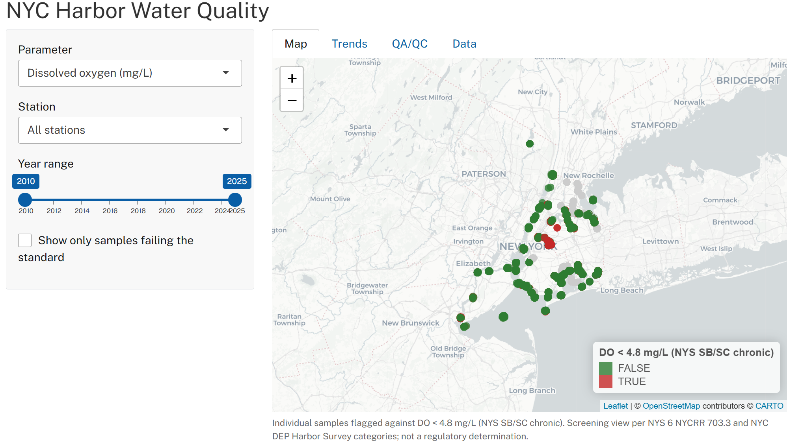

# NYC Harbor Water Quality Dashboard

An interactive dashboard and data pipeline for NYC DEP Harbor Survey water quality data, built with R, PostgreSQL/PostGIS, and Shiny.

**Live dashboard:** [add shinyapps.io link]




## Overview

The NYC Department of Environmental Protection's Harbor Survey is one of the longest-running urban water quality monitoring programs in the country, with records dating back over a century. This project pulls the publicly available survey data, runs it through a documented quality-control pipeline, stores it in a spatial database, and serves it through an interactive dashboard.

## Features

- **Interactive map** with station-level water quality values and regulatory-standard flagging (meets / fails)
- **Time-series trends** for each parameter and station
- **QA/QC audit tab** documenting the data-quality issues found and how they were handled
- **Data export** for downstream use

## Data source

- [NYC Open Data — Harbor Water Quality](https://data.cityofnewyork.us/Environment/Harbor-Water-Quality/5uug-f49n) (asset `5uug-f49n`)
- ~33,000 records
- January 1, 2010 – December 31, 2025
- Retrieved via the Socrata SoQL API, with a record-count check to confirm the pull was complete and not silently truncated

## Data quality (QA/QC)

The public dataset required substantial cleaning before it could be mapped or analyzed. The QA/QC tab in the dashboard reports these findings; the highlights:

**Transposed coordinates.** A number of records had their latitude and longitude values swapped (for example, a latitude reading near −73, which is impossible for the harbor). Because NY Harbor sits in a narrow, known coordinate window, these were identified programmatically and corrected, with the original values preserved and each record flagged rather than silently overwritten.

**Missing coordinates.** About 16,700 records — roughly half the dataset — have no coordinates in the source data at all. Rather than discard these (the water quality measurements are valid science; only the location metadata is missing), the measurements were retained and joined to a validated station-location table. Records with no coordinates are excluded from the map but remain available for analysis.

**Orphan station codes.** 28 station codes appear in the measurements but have no published coordinates. These fall into distinct categories rather than being random errors: a discrete 2015 special study (EJ1–EJ9), two routine Jamaica Bay stations with unpublished locations (J13, J17), several sub-stations of parent stations, and one laboratory QC blank. Each was classified and documented. The QC blank is a laboratory control rather than harbor water, so it is excluded from all water quality summaries.

The database schema enforces these decisions: measurements reference stations through a foreign key, so the database itself refuses any record pointing to a station that does not exist — which is how the orphan station codes were surfaced in the first place.

## Architecture

The pipeline runs in four stages:

**pull → clean → PostGIS → export → Shiny**

1. **Pull** the raw data from the NYC Open Data API and verify the record count.
2. **Clean** the coordinates: correct transpositions, flag unresolvable records, classify station types.
3. **Load** into a normalized PostgreSQL/PostGIS database with primary keys, a foreign-key constraint, and a spatial index. Coordinates are stored once per station rather than repeated on every record.
4. **Export** the cleaned tables as `.rds` files that the Shiny app reads at startup (keeping the app fast and deployable).

The Shiny app reads the exported extract rather than querying the database live. This keeps load times low on shinyapps.io's free tier; in a production setting the app would query the database directly.

## How to run it

**Prerequisites**

- R (4.5+) with packages: `httr2`, `dplyr`, `sf`, `DBI`, `RPostgres`, `shiny`, `bslib`, `leaflet`, `lubridate`
- PostgreSQL with the PostGIS extension enabled
- A `.Renviron` file in the project root containing your database password (and optionally a Socrata app token):

  ```
  PG_PASSWORD=your_password_here
  SODA_APP_TOKEN=your_token_here
  ```

  Restart R after creating it. `.Renviron` is gitignored and should never be committed.

**Database setup (once)**

```sql
CREATE DATABASE harbor;
\c harbor
CREATE EXTENSION postgis;
```

**Run the pipeline in order**

```r
source("scripts/01_datapull_and_clean.R")    # API pull + coordinate cleaning
source("scripts/02_load_postgis.R")   # load to PostGIS + export .rds files
shiny::runApp("scripts")                 # launch the dashboard
```

## Repository structure

```
NYC_MSS/
├── README.md
├── app.R                         # the Shiny dashboard
├── scripts/
│   ├── 01_datapull_and_clean.R       # pull from API, verify count, fix coordinates
│   ├── 02_load_postgis.R      # normalize, load to PostGIS, export for the app
│   ├── theme.R                   # dashboard styling (Public Sans, NYC palette)
│   └── queries_demo.R            # example spatial queries (not part of the pipeline)
├── data/                         # exported .rds files the app reads (gitignored if large)
└── images/                       # screenshots for this README
```

## Notes and limitations

- **The standard flagging is a screening view, not a regulatory determination.** The map flags individual grab samples that fall outside a threshold. The actual NYS standards are expressed as daily averages (dissolved oxygen) or multi-week geometric means (bacteria), so a single flagged sample is not a formal violation.
- **The app reads a static extract**, not a live database connection. The database is the storage and integrity layer; the dashboard serves a published snapshot.
- **Coordinates are stored per station.** Because the source data's per-record coordinates were inconsistent, the map uses one validated location per station rather than each record's raw coordinate.

## Standards references

- New York State saltwater dissolved oxygen standard (classes SA, SB, SC): chronic daily-average minimum of 4.8 mg/L, acute minimum of 3.0 mg/L — 6 NYCRR 703.3.
- NYC DEP Harbor Survey reporting categories: dissolved oxygen (<3.0, 3.0–3.9, 4.0–4.9, ≥5.0 mg/L) and fecal coliform (<100, 100–200, 201–2,000, >2,000 cfu/100mL).
- Enterococci single-sample recreational threshold (~104 CFU/100 mL) per U.S. EPA recreational water quality criteria.

---

*Built with public data from NYC Open Data. This is an independent portfolio project and is not affiliated with or endorsed by NYC DEP.*